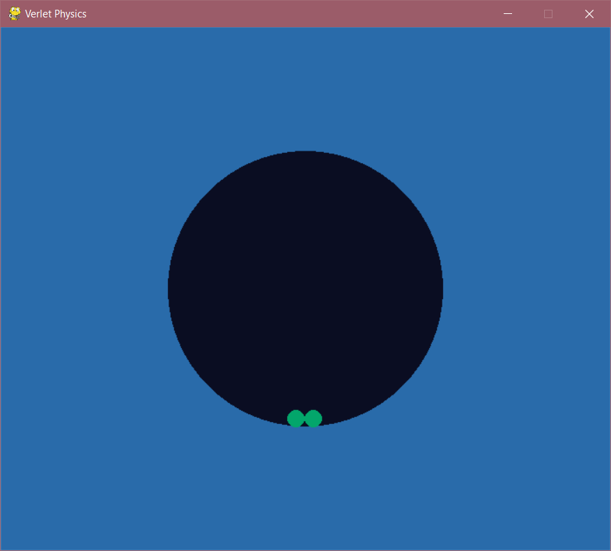

## using verlet,python,pygame,pezzza's work project, to make a verlet ball physics engine

[link with title](https://youtube.com/watch?v=lS_qeBy3aQI"original video")

[link with title](https://github.com/thetomato0/Verlet-python"Github page ")

Go back [home](/).
